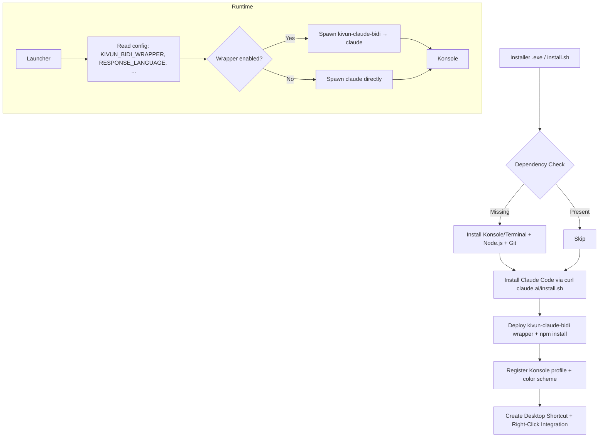
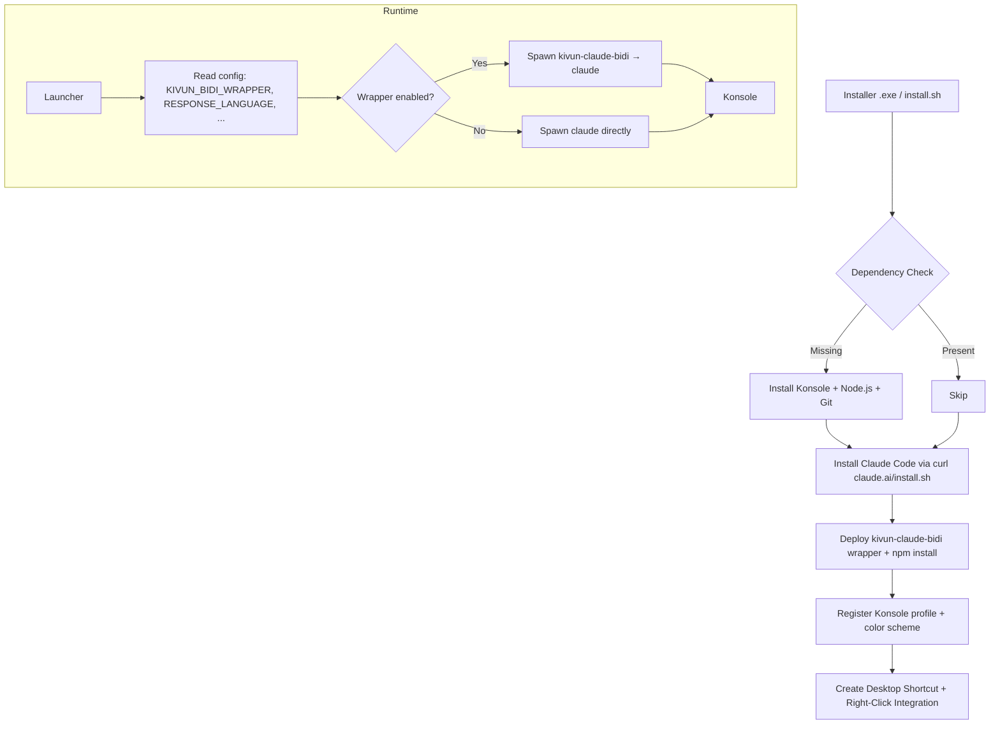

<p align="center">
  
</p>

<p align="center">
  <video src="https://github.com/noambrand/kivun-terminal-wsl/releases/download/v1.1.0/kivun_terminal_Hebrew_demo.mp4" width="700" controls muted playsinline></video>
</p>

<p align="center">
  <em>📹 Demo: Hebrew Claude Code session inside Kivun Terminal -
  <a href="https://github.com/noambrand/kivun-terminal-wsl/releases/download/v1.1.0/kivun_terminal_Hebrew_demo.mp4">download MP4 (12 MB)</a>
  if your browser doesn't autoplay above.</em>
</p>

<p align="center">
  <a href="LICENSE"></a>
  
  
  
  <a href="https://github.com/noambrand/kivun-terminal-wsl/releases/latest"></a>
</p>

<h3 align="center">Real RTL Claude Code terminal. Hebrew, Arabic, Persian, Urdu and 8 more - rendered correctly, on Windows and Linux.</h3>

<p align="center"><sub><strong>macOS support deprecated as of v1.2.4</strong> — no native Mac terminal renders mixed Hebrew+English correctly today. <a href="mac/README.md">Details &amp; uninstall instructions →</a></sub></p>

<p align="center">
  <a href="#quick-start">Quick Start</a> &bull;
  <a href="#why-kivun-terminal">Why Kivun Terminal?</a> &bull;
  <a href="#bidi-wrapper">BiDi Wrapper</a> &bull;
  <a href="#architecture">Architecture</a> &bull;
  <a href="#configuration">Configuration</a> &bull;
  <a href="docs/CHANGELOG.md">Changelog</a> &bull;
  <a href="docs/TROUBLESHOOTING.md">Troubleshooting</a>
</p>

---

<table align="center" border="0" cellspacing="0" cellpadding="6"><tr>
<td valign="middle"></td>
<td valign="middle"><a href="#english"><b>English</b></a></td>
<td valign="middle"></td>
<td valign="middle"><a href="#%D7%A2%D7%91%D7%A8%D7%99%D7%AA"><b>עברית</b></a></td>
</tr></table>

## English

> 💡 **Working in English (LTR) only?** Check out the sister project **[ClaudeCode Launchpad CLI](https://github.com/noambrand/kivun-terminal)** - same launcher concept, faster startup (~2 s), no WSL needed. Kivun Terminal is the right pick when you need RTL/BiDi rendering for Hebrew, Arabic, Persian, etc.

## Why Kivun Terminal?

|  | Launchpad CLI v2.4.2 | Kivun Terminal v1.2.4 |
|---|---|---|
| **Runtime (Windows)** | Windows Terminal (native) | WSL2 + Ubuntu + Konsole |
| **RTL/BiDi rendering** | LTR only (Windows Terminal has no BiDi engine) | ✅ Full RTL + line-start RLM fix for Claude's bullet-line direction bug ([anthropics/claude-code#39881](https://github.com/anthropics/claude-code/issues/39881)) |
| **Supported RTL languages** | 0 | 11 (hebrew, arabic, persian, urdu, pashto, kurdish, dari, uyghur, sindhi, yiddish, syriac) |
| **Linux support** | Windows + macOS only (Linux planned) | ✅ apt / dnf / pacman / zypper |
| **macOS support** | ✅ .pkg | ❌ Deprecated as of v1.2.4 (no Mac terminal renders mixed Hebrew+English correctly — see [`mac/README.md`](mac/README.md)) |
| **Statusline** (model, context %, usage limits) | ✅ pre-installed | ✅ pre-installed (same `statusline.mjs`) |
| **Light-blue "Kivun" terminal theme** | ✅ Windows Terminal color scheme | ✅ Konsole `KivunTerminal` profile + `ColorSchemeNoam` |
| **Startup time** | ~2 s | ~6 s (Konsole launch) |
| **Install footprint (Windows)** | ~150 MB | ~2 GB (WSL + Ubuntu) |

## What's included out of the box

- **Folder picker dialog** on the desktop shortcut — browse the folder tree **or** type/paste a Windows path directly in the same dialog (no separate prompt to wade through). Cancel = open in your home directory.
- **Right-click "Open with Kivun Terminal"** on any folder in File Explorer — launches straight into that folder, skipping the picker.
- **Live two-line statusline** at the bottom of every Claude Code session — model, context %, total tokens, session duration, and 5-hour / 7-day usage with countdown to reset.
- **Light-blue Kivun theme** for Konsole (`#C8E6FF` background) — easy on the eyes, on by default. Disable via `TERMINAL_COLOR=default`.
- **BiDi wrapper** that fixes Hebrew/Arabic/Persian rendering bugs in Claude Code's TUI (see [BiDi Wrapper](#bidi-wrapper) below for the seven specific fixes).
- **Auto-installs everything** — WSL2 + Ubuntu + Konsole + Node.js + Claude Code itself, on a clean Windows machine. The installer asks once and handles the rest.

## Quick Start

### Windows

1. **One-time WSL setup** (skip if `wsl --status` already prints WSL info): open **Terminal (Admin)**, run `wsl --install`, reboot.
2. **[Download `Kivun_Terminal_Setup.exe`](https://github.com/noambrand/kivun-terminal-wsl/releases/latest)**
3. Double-click to run - no admin rights needed once WSL is up.
4. Double-click the **Kivun Terminal** desktop shortcut → pick a folder (browse the tree or paste a Windows path in the same dialog), or right-click any folder in File Explorer → **Open with Kivun Terminal** (skips the picker).

> **Windows 11 - Smart App Control may block the installer.** If you see *"Smart App Control blocked an app that may be unsafe"* (clicking *Ok* dismisses it without an *override* option), the installer is unsigned and SAC won't allow unknown apps at all. To install: open **Start** → search **Smart App Control** → set it to **Off**. SAC cannot be re-enabled without reinstalling Windows, so leave it Off only if you're comfortable running other unsigned apps. See [SmartScreen warning](#windows-smartscreen) below for the milder warning you'll get with SAC off.

<a id="windows-smartscreen"></a>
> **Windows SmartScreen warning** (different from SAC): with SAC off, you may still see *"Windows protected your PC"*. Click **More info** → **Run anyway**. The installer is unsigned today; the warning will fade once enough downloads accumulate Microsoft's reputation signal.

### Linux

```bash
git clone https://github.com/noambrand/kivun-terminal-wsl.git
cd kivun-terminal-wsl
./linux/install.sh
```

Supports apt (Debian/Ubuntu), dnf (Fedora/RHEL), pacman (Arch/Manjaro), zypper (openSUSE). Installs Konsole, Node.js, Git, Claude Code, the BiDi wrapper, and right-click integrations for Nautilus + Dolphin.

### macOS

**Not supported as of v1.2.4.** No native macOS terminal renders mixed Hebrew + English correctly today (Apple Terminal lacks a BiDi engine, iTerm2 3.6.x mirrors Hebrew, WezTerm's `bidi_enabled` is half-broken in mixed scripts). For Hebrew work on Mac, use a Windows or Linux machine. Full context, evidence, and uninstall instructions in [`mac/README.md`](mac/README.md). Existing v1.2.x Mac users can still download the deprecated `.pkg` from the [v1.2.3 release](https://github.com/noambrand/kivun-terminal-wsl/releases/tag/v1.2.3) for rollback purposes.

> First run on Windows or Linux requires a Claude Pro/Max subscription or an [Anthropic API key](https://console.anthropic.com).

## Status Bar

A two-line live status bar at the bottom of every Claude Code session - the same `statusline.mjs` ships in all three installers and registers into `~/.claude/settings.json` automatically:

> **MyProject** | 🟢 Sonnet 4.6 | Context 🟩🟩🟩🟩🟩⬜⬜⬜⬜⬜ 51% | tokens: 284K | 24:13
>
> Session 🟨🟨🟨🟨🟨🟨🟨🟨⬜⬜ 77% resets in 4h15m &nbsp;|&nbsp; Weekly 🟩🟩⬜⬜⬜⬜⬜⬜⬜⬜ 16% resets in 6d18h

| Field | What it shows |
|-------|---------------|
| **Model** | Active Claude model (color-coded: green = Opus, yellow = Sonnet/Haiku) |
| **Context** | % of context window consumed (green/yellow/red) |
| **Tokens** | Combined input + output tokens this session |
| **Session / Weekly** | Usage limit % with countdown to reset |

## Terminal Theme

A custom **light-blue Kivun color scheme** (`#C8E6FF` background, dark text, blue cursor) ships with every installer and is enabled by default:

| Platform | What gets configured | File |
|---|---|---|
| Windows (WSL+Konsole) | `KivunTerminal.profile` + `ColorSchemeNoam.colorscheme` | `~/.local/share/konsole/` (WSL) |
| Linux (Konsole) | Same profile + color scheme | `~/.local/share/konsole/` |

Disable via `TERMINAL_COLOR=default` in your config to fall back to the terminal emulator's defaults.

## BiDi Wrapper

v1.1.0 ships a `kivun-claude-bidi` Node.js wrapper that pipes Claude Code's output through a state machine doing seven complementary fixes for known Konsole BiDi limitations. Every fix here was added in response to a specific user-visible Hebrew rendering bug; cumulatively they make Hebrew/English mixed terminal output behave the way `<bdi>` makes it behave in HTML.

| Fix | What it does | Solves | Default |
|---|---|---|---|
| **RLE/PDF bracketing of Hebrew runs in LTR paragraphs** | Wraps every Hebrew run in `U+202B` / `U+202C` *only* when the surrounding paragraph is LTR | Hebrew embedded in English needs an explicit direction marker; otherwise BiDi sees Hebrew chars as just another part of the LTR flow | on |
| **Line-start RLM injection** | Inserts `U+200F` at the start of any line whose first strong char is RTL | Fixes Claude's `● שלום` first-line LTR bug ([anthropics/claude-code#39881](https://github.com/anthropics/claude-code/issues/39881)) | on |
| **Bullet-strip** (v1.1.8) | Removes the leading `●` from Hebrew bullet lines so the line's first visible char is Hebrew | Konsole 23.x classifies `●` as a direction-anchoring neutral; without strip, lines stay LTR even with line-start RLM | on |
| **Strip-incoming bidi controls** (v1.1.9) | Strips embedding (`U+202A`–`U+202E`) and isolate (`U+2066`–`U+2069`) marks from Claude's stream; preserves LRM/RLM | Stops upstream-emitted bidi controls from compounding with wrapper-injected RLM and producing nondeterministic positioning | auto |
| **Flatten colors on RTL lines** (v1.1.10) | Strips ANSI SGR (CSI`...m`) sequences from any line whose first strong char is Hebrew so the line is one attribute run | Konsole's BiDi only runs within continuous-attribute regions; color changes split the BiDi run and Qt mispositions the resulting fragments | on |
| **No per-run RLE/PDF on RTL lines** (v1.1.11) | When the line is already RTL via line-start RLM, skip per-Hebrew-run RLE/PDF brackets — let UAX #9 handle direction across the whole single-attribute line | Per-run brackets *themselves* act as attribute-region boundaries; on lines with multiple Hebrew runs separated by LTR runs, they recreated the same misposition v1.1.10 was supposed to fix | off |
| **Cursor-forward → space replacement on RTL lines** (v1.1.16, **user-confirmed working** April 2026) | Replaces each `\x1b[NC` cursor-forward CSI with N literal space characters on RTL lines. Visually identical (cursor moves over presumed-blank cells; spaces write to those same cells) but no attribute-region boundary | Claude Code's TUI uses cursor-forward escapes instead of literal spaces between every word — confirmed via `KIVUN_BIDI_DUMP_RAW=on` capture showing **306 cursor-forward CSIs in one short Hebrew session**. Each one was splitting Konsole's BiDi run the same way SGR colors did, just invisibly. v1.1.10 caught the visible color splitters; v1.1.16 catches the invisible cursor-forward splitters | on (gated on the same `KIVUN_BIDI_FLATTEN_COLORS_RTL` flag) |

**Why this isn't fixable upstream:** Konsole has no real BiDi engine — it hands continuous-attribute regions to Qt's text layout, and Qt has no idea where a colored, bracketed, or cursor-positioned fragment logically belongs in the surrounding RTL paragraph. This is documented at [terminal-wg.pages.freedesktop.org](https://terminal-wg.pages.freedesktop.org/bidi/prior-work/terminals.html) and was empirically confirmed via April 2026 A/B tests on Konsole 23.08.5. KDE has shown no signs of changing it; the wrapper's job is to give Konsole exactly what it can render correctly: a single attribute run per RTL line.

**Trade-offs:**
- v1.1.10 flatten loses syntax color on Hebrew lines. Set `KIVUN_BIDI_FLATTEN_COLORS_RTL=off` to keep colors at the cost of broken positioning. (v1.1.16 cursor-forward replacement is gated on the same flag, so opting out of color-flatten also opts out of cursor-forward replacement.)
- v1.1.11 no-bracket is the cleaner path; if you preferred the legacy v1.1.0–v1.1.10 behavior set `KIVUN_BIDI_BRACKET_RTL_RUNS=on`.

**The "look for invisible CSI splitters" debugging pattern** (v1.1.16 lesson learned, also captured in `docs/TROUBLESHOOTING.md`): when a wrapper-rendered terminal output looks wrong even though all *visible* escapes (colors, RLE/PDF) are stripped, look for *invisible* CSI sequences acting as attribute-region boundaries. Cursor-forward (`...C`), cursor-back (`...D`), set/reset mode (`...h`/`...l`) all qualify. Turn on `KIVUN_BIDI_DUMP_RAW=on` and inspect `~/.local/state/kivun-terminal/bidi-raw-dump.bin` — anything that *looks* like text in the dump but is actually an escape sequence is a candidate splitter.

Toggle the wrapper itself via `KIVUN_BIDI_WRAPPER=on|off` in your config. Each individual fix has its own toggle (`KIVUN_BIDI_STRIP_BULLET`, `KIVUN_BIDI_STRIP_INCOMING`, `KIVUN_BIDI_FLATTEN_COLORS_RTL`, `KIVUN_BIDI_BRACKET_RTL_RUNS`). Test coverage as of v1.1.16: 87 injector unit fixtures + end-to-end smoke against a fake-claude stand-in via node-pty.

## Architecture



## Tech Stack

| Component | Technology | Purpose |
|-----------|-----------|---------|
| Windows installer | NSIS | Per-user install with WSL/Ubuntu/Konsole bootstrap |
| Linux installer | Bash + apt/dnf/pacman/zypper | Distro-aware package install + user-home deploy |
| BiDi wrapper | Node.js + node-pty | Pipes Claude output through Unicode RLE/PDF/RLM state machine |
| Konsole profile | KDE Konsole `.profile` + `.colorscheme` | Light-blue Kivun theme + BidiEnabled=true |
| Language map | Shared `payload/languages.sh` | 23-language `--append-system-prompt` map sourced by all launchers |
| CI/CD | GitHub Actions | Automated Windows .exe + Linux .tar.gz builds on tag |

## Configuration

Per-platform config files (same schema across all three):

| Platform | Path |
|---|---|
| Windows | `%LOCALAPPDATA%\Kivun-WSL\config.txt` |
| Linux | `~/.config/kivun-terminal/config.txt` |

```ini
RESPONSE_LANGUAGE=hebrew         # 23+ languages supported
TEXT_DIRECTION=rtl               # rtl or ltr
KIVUN_BIDI_WRAPPER=on            # on (default) or off
CLAUDE_FLAGS=                    # e.g. --continue
```

See `docs/CHANGELOG.md` for the full list of supported languages and config keys.

## Contributing

Contributions welcome. Areas where help is especially useful:

- **Wayland keyboard toggle** - `setxkbmap` is X11-only; Wayland needs DE-specific layout switching.
- **More RTL language coverage** - N'Ko, Adlam, Mandaic, and a few others currently fall back to Hebrew xkb layouts.
- **Integration testing** - different distros, different DEs, different Konsole versions.

Fork the repo, make your changes, and open a PR.

## 🤝 Related projects in the RTL-for-AI-tools community

Six independent developers each built userland RTL fixes for the AI-tooling stack. The fact that all of us had to ship our own fix is itself a comment on how overdue the upstream BiDi work is:

- **[Adaptive-RTL-Extension](https://github.com/Lidor-Mashiach/Adaptive-RTL-Extension)** by Lidor Mashiach — generic browser extension with click-to-select RTL for any website, including LLM chat UIs (Claude.ai, ChatGPT, Gemini, etc.).
- **[Claude.ai RTL Support (Chrome extension)](https://chromewebstore.google.com/detail/claude-ai-rtl-support/lkopcjdmfmffphbomfhecalbojiaeape)** — Chrome extension purpose-built for Claude.ai specifically. Lighter than the generic adaptive one if you only need RTL on Claude's web UI.
- **[rtl-for-vs-code-agents](https://github.com/GuyRonnen/rtl-for-vs-code-agents)** by Guy Ronnen — VS Code extension covering Claude Code, Cursor, Antigravity, and Gemini Code Assist in the VS Code webview layer.
- **[Claude Code RTL Support](https://open-vsx.org/extension/yechielby/claude-code-rtl)** by Yechiel Bar-Yehuda — VS Code / Cursor / Antigravity extension purpose-built for the official Claude Code IDE plugin. 2,400+ Open VSX installs. Complementary to Guy Ronnen's broader webview fix above — pick this one if you specifically live inside the Claude Code IDE panel.
- **[Claude-for-word-RTL-fix](https://github.com/asaf-aizone/Claude-for-word-RTL-fix)** by Asaf Aizone — Hebrew/Arabic RTL fix for the Claude for Word (Desktop) add-in.
- **[kivun-terminal-wsl](https://github.com/noambrand/kivun-terminal-wsl)** (this repo) — terminal-layer fix: a `kivun-claude-bidi` Node wrapper for Claude Code's TUI output, plus a one-click installer for WSL2+Konsole on Windows or Konsole on Linux. (macOS deprecated as of v1.2.4 — see [`mac/README.md`](mac/README.md).)

The surfaces (generic browser DOM, Claude.ai web UI, VS Code / IDE webview, Microsoft Word, terminal) are largely disjoint — pick the one that matches where you're hitting the BiDi problem.

<div dir="rtl">

## עברית

> 💡 **עובדים רק באנגלית (LTR)?** הציצו בפרויקט האח **[ClaudeCode Launchpad CLI](https://github.com/noambrand/kivun-terminal)** - אותו קונספט שיגור, אתחול מהיר יותר (~2 שניות), בלי WSL. כיוון טרמינל מתאים כשצריך תמיכת RTL/BiDi בעברית, ערבית, פרסית וכד'.

### 🎯 מה זה?

כיוון טרמינל היא חבילת התקנה ושיגור עבור Claude Code עם תמיכה מלאה ב-RTL. רץ על Windows (דרך WSL2 + Konsole) ו-Linux. הוא פותר את בעיית הצגת עברית/ערבית/פרסית/אורדו ועוד 7 שפות RTL ב-CLI של Claude Code, שלא נתמכות כראוי כברירת מחדל בטרמינלים מודרניים.

> ⚠️ <strong>תמיכת macOS הוסרה ב-v1.2.4.</strong> אין כיום אמולטור טרמינל ב-macOS שמציג עברית+אנגלית מעורבת בצורה תקינה (Apple Terminal חסר מנוע BiDi, iTerm2 3.6.x מהפך עברית, BiDi של WezTerm חצי-שבור). למשתמשי Mac שצריכים עברית - השתמשו ב-Windows או Linux. פרטים והוראות הסרה ב-<a href="mac/README.md"><code>mac/README.md</code></a>.

כיוון מתקין את Claude Code, מקנפג את הטרמינל לפרופיל המתאים, ומעביר את הפלט של Claude דרך wrapper ייעודי (`kivun-claude-bidi`) שמטפל בבעיות הכיוון של עברית - כולל הבאג המעצבן שגרם לשורה הראשונה בכל תגובה להופיע מיושרת לשמאל.

### ✨ במה זה שונה?

- **לעומת Claude Code ב-Windows Terminal:** ל-Windows Terminal אין מנוע BiDi כלל; כל פלט עברי מוצג LTR וקרוס. כיוון מריץ את הפלט דרך WSL2 + Konsole, שכן יש לה מנוע BiDi מלא.
- **לעומת Claude Code ב-VS Code:** כיוון הוא לטרמינל, לא ל-IDE. אם אתם עובדים בעיקר משורת פקודה - זה מה שאתם רוצים. למי שעובד מ-IDE יש פתרון נפרד של [גיא רונן](https://github.com/GuyRonnen/rtl-for-vs-code-agents) (ראו פרויקטים קשורים למטה).
- **לעומת Claude Desktop:** Desktop הוא בעיקר ממשק צ'אט - לא עובד בפועל על הקבצים בפרויקט שלכם. **בחרו ב-Desktop** לשאלות מהירות וצ'אט. **בחרו בכיוון** כשאתם רוצים ש-Claude יעבוד אמת בפרויקט (יפתח קבצים, יערוך, יריץ פקודות) - ובמיוחד אם התוכן כולל עברית או RTL.
- **לעומת אפליקציות הצ'אט של Claude (Claude.ai בדפדפן ואפליקציית המובייל לאייפון/אנדרואיד):** ממשקי הצ'אט הם שיחה בלבד - לא יכולים לקרוא קבצים מהמחשב שלכם, להריץ פקודות, או לערוך קוד בפועל. בחרו בצ'אט לשאלה מהירה ובודדת; בחרו ב-Claude Code (ובכיוון, לעבודה בעברית/RTL) כשרוצים assistant שעובד אמת בפרויקט שלכם - קורא קבצים, מריץ tests, ועושה commits.

### 🚀 פיצ'רים

- ✅ הצגה תקינה של עברית/ערבית/פרסית/אורדו ועוד 7 שפות RTL בפלט של Claude Code
- ✅ תיקון לבאג של השורה הראשונה (`● שלום` היה מופיע משמאל לימין; עכשיו מימין לשמאל)
- ✅ פרופיל Konsole בצבעי Kivun (תכלת בהיר, נעים לעין)
- ✅ סטטוסליין חי בתחתית המסך (מודל פעיל, אחוז קונטקסט, מגבלות שימוש)
- ✅ קיצור דרך לשולחן העבודה + תפריט קליק ימני על תיקיות
- ✅ Folder picker - דיאלוג אחד: עיון בעץ התיקיות או הקלדה/הדבקה של נתיב באותו חלון
- ✅ Alt+Shift להחלפה בין עברית לאנגלית בתוך הטרמינל
- ✅ נתמך על Windows ו-Linux (apt/dnf/pacman/zypper). תמיכת macOS הוסרה ב-v1.2.4 - ראו <a href="mac/README.md"><code>mac/README.md</code></a>

### 📥 התקנה

הוראות ההתקנה מפורטות באנגלית בקטעי **Quick Start** למעלה. הפקודות (`npm install`, נתיבים וכד') זהות בכל השפות ולא תורגמו. בקצרה:

<ul dir="rtl" align="right">
<li><strong>Windows:</strong> <code>wsl --install</code> חד-פעמי, אז להוריד את <code>Kivun_Terminal_Setup.exe</code> מ-<a href="https://github.com/noambrand/kivun-terminal-wsl/releases/latest">הגרסה האחרונה</a> ולהריץ.</li>
<li><strong>Linux:</strong> <code>git clone</code> + <code>./linux/install.sh</code>. תומך ב-apt/dnf/pacman/zypper.</li>
<li><strong>macOS:</strong> לא נתמך מ-v1.2.4 ואילך - ראו <a href="mac/README.md"><code>mac/README.md</code></a>.</li>
</ul>

<blockquote dir="rtl" align="right">
<strong>Windows 11 - Smart App Control חוסם את ההתקנה.</strong> אם רואים <em>"Smart App Control blocked an app that may be unsafe"</em> בלי כפתור עקיפה - SAC לא מאפשר אפליקציות לא חתומות בכלל. כדי להתקין: פותחים <strong>Start</strong> ← מחפשים <strong>Smart App Control</strong> ← מעבירים ל-<strong>Off</strong>. אי אפשר להפעיל מחדש את SAC בלי התקנה מחדש של Windows, אז להשאיר Off רק אם זה בסדר עבורכם להריץ אפליקציות לא חתומות אחרות. אחרי שמכבים את SAC, ייתכן שעדיין תופיע אזהרת SmartScreen <em>"Windows protected your PC"</em> - לוחצים <strong>More info</strong> ואז <strong>Run anyway</strong>.
</blockquote>

### 📊 סטטוסליין

סטטוסליין חי בשתי שורות בתחתית כל סשן Claude Code - אותו `statusline.mjs` מותקן בכל ההתקנות (Windows / Linux) ונרשם אוטומטית ב-`~/.claude/settings.json`:

> **MyProject** | 🟢 Sonnet 4.6 | Context 🟩🟩🟩🟩🟩⬜⬜⬜⬜⬜ 51% | tokens: 284K | 24:13
>
> Session 🟨🟨🟨🟨🟨🟨🟨🟨⬜⬜ 77% resets in 4h15m &nbsp;|&nbsp; Weekly 🟩🟩⬜⬜⬜⬜⬜⬜⬜⬜ 16% resets in 6d18h

| שדה | מה זה מציג |
|------|------------|
| **מודל** | המודל הפעיל של Claude (צבעים: ירוק = Opus, צהוב = Sonnet/Haiku) |
| **קונטקסט** | אחוז חלון הקונטקסט שנוצל (ירוק/צהוב/אדום) |
| **טוקנים** | סכום קלט + פלט בסשן הזה |
| **Session / Weekly** | אחוז מגבלת השימוש עם ספירה לאיפוס |

### 🎨 ערכת נושא לטרמינל

ערכת צבעים בתכלת בהיר של Kivun (`#C8E6FF` ברקע, טקסט כהה, סמן כחול) מותקנת אוטומטית ומופעלת כברירת מחדל:

| פלטפורמה | מה מותקן | קובץ |
|---|---|---|
| Windows (WSL+Konsole) | `KivunTerminal.profile` + `ColorSchemeNoam.colorscheme` | `~/.local/share/konsole/` (בתוך WSL) |
| Linux (Konsole) | אותו פרופיל וערכת צבעים | `~/.local/share/konsole/` |

לחזור לברירת המחדל של הטרמינל: להגדיר `TERMINAL_COLOR=default` בקובץ ה-config.

### 🧠 על תמיכת ה-RTL

ה-wrapper `kivun-claude-bidi` הוא מודול Node שמלפף סביב Claude Code. הוא מזהה רצפי טקסט בעברית בפלט ועוטף אותם בסימני BiDi של Unicode (RLE/PDF), כך שהם מוצגים בכיוון הנכון גם בטרמינלים שתמיכת ה-BiDi שלהם חלקית. בנוסף, הוא מחדיר RLM (U+200F) בתחילת כל שורה שהאות החזקה הראשונה שלה היא RTL - מה שמתקן את הבאג ב-Claude Code שבו `● שלום` היה מופיע משמאל לימין במקום מימין לשמאל.

**אופציונלי - עוקף לבעיית ה-bullet ב-Konsole 23.x:** אם אתם על Konsole 23.x (ברירת המחדל ב-Ubuntu 24.04) ושורות bullet בעברית עדיין מופיעות LTR גם אחרי תיקון ה-RLM, ניתן להפעיל `KIVUN_BIDI_STRIP_BULLET=on` ב-`config.txt` (ברירת מחדל `off`). זה מסיר את ה-`●` מתחילת שורות עבריות, כך שהתו הראשון הוא עברית וה-BiDi מתהפך אוטומטית. המחיר: הסימן `●` נעלם מ-bullet-lines בעברית (רק ההזחה נשארת). Konsole 24.04+ אמור לפתור את זה ב-upstream.

לפירוט מלא של האלגוריתם, ראו [`docs/specs/BIDI_ALGORITHM.md`](docs/specs/BIDI_ALGORITHM.md). למעקב אחרי הבאג ב-upstream של Anthropic, ראו [anthropics/claude-code#39881](https://github.com/anthropics/claude-code/issues/39881). אם אתם רוצים לתרום תיעוד עברי לריפו הזה, יש מדריך מעשי ב-[`docs/HEBREW_RTL_GITHUB.md`](docs/HEBREW_RTL_GITHUB.md) על איך לכתוב עברית שתעבוד נכון ב-GitHub.

### 🏗️ ארכיטקטורה



### 🧰 ערכת הכלים

| רכיב | טכנולוגיה | מטרה |
|------|-----------|------|
| התקנה ל-Windows | NSIS | התקנה למשתמש בלבד עם בוטסטראפ של WSL/Ubuntu/Konsole |
| התקנה ל-Linux | Bash + apt/dnf/pacman/zypper | התקנת חבילות מודעת-distro + פריסה לבית המשתמש |
| BiDi wrapper | Node.js + node-pty | מעביר פלט Claude דרך מכונת מצבים של Unicode RLE/PDF/RLM |
| פרופיל Konsole | KDE Konsole `.profile` + `.colorscheme` | ערכת Kivun בתכלת + `BidiEnabled=true` |
| מפת שפות | `payload/languages.sh` משותף | מפת `--append-system-prompt` ל-23 שפות, נטענת על ידי כל המשגרים |
| CI/CD | GitHub Actions | בנייה אוטומטית של `.exe` ל-Windows + `.tar.gz` ל-Linux בכל tag |

### ⚙️ קונפיגורציה

קובצי קונפיג לפי פלטפורמה (אותה סכמה ב-2):

| פלטפורמה | נתיב |
|---|---|
| Windows | `%LOCALAPPDATA%\Kivun-WSL\config.txt` |
| Linux | `~/.config/Kivun-Terminal/config.txt` |

```ini
RESPONSE_LANGUAGE=hebrew         # 23+ שפות נתמכות
TEXT_DIRECTION=rtl               # rtl או ltr
KIVUN_BIDI_WRAPPER=on            # on (ברירת מחדל) או off
AUTO_INSTALL_CLAUDE=yes          # yes (ברירת מחדל) / ask / no
CLAUDE_FLAGS=                    # למשל --continue
```

ראו [`docs/CHANGELOG.md`](docs/CHANGELOG.md) לרשימה המלאה של השפות הנתמכות וכל מפתחות ה-config.

### 🤝 תרומה לפרויקט

תרומות מתקבלות בברכה. תחומים שעזרה בהם במיוחד שימושית:

- **מתג מקלדת ל-Wayland** - `setxkbmap` עובד רק ב-X11; Wayland צריך החלפת layout ספציפית לסביבת השולחן.
- **כיסוי שפות RTL נוספות** - N'Ko, Adlam, Mandaic ועוד מספר שפות נופלות כרגע ל-fallback של מפת ה-xkb של עברית.
- **בדיקות אינטגרציה** - distro-ים שונים, סביבות שולחן עבודה שונות, גרסאות Konsole שונות.

עשו fork לריפו, בצעו את השינויים, ופתחו PR.

### 🤝 פרויקטים קשורים בקהילת RTL-for-AI-tools

שישה מפתחים עצמאיים בנו פתרונות RTL לסביבות השונות של ה-AI tooling. העובדה שכולנו נאלצנו לכתוב פתרון userland נפרד מעידה לבדה על כמה זמן זה כבר נדחה ב-upstream:

<ul dir="rtl" align="right">
<li><strong><a href="https://github.com/Lidor-Mashiach/Adaptive-RTL-Extension">Adaptive-RTL-Extension</a></strong> מאת לידור משיח - הרחבת דפדפן גנרית עם click-to-select ל-RTL בכל אתר, כולל ממשקי צ'אט של מודלי שפה.</li>
<li><strong><a href="https://chromewebstore.google.com/detail/claude-ai-rtl-support/lkopcjdmfmffphbomfhecalbojiaeape">Claude.ai RTL Support (הרחבת Chrome)</a></strong> - הרחבה ל-Chrome ייעודית ל-Claude.ai. קלה יותר מהגנרית אם אתם צריכים RTL רק על ממשק הווב של Claude.</li>
<li><strong><a href="https://github.com/GuyRonnen/rtl-for-vs-code-agents">rtl-for-vs-code-agents</a></strong> מאת גיא רונן - הרחבה ל-VS Code עבור Claude Code, Cursor, Antigravity ו-Gemini Code Assist בשכבת ה-webview.</li>
<li><strong><a href="https://open-vsx.org/extension/yechielby/claude-code-rtl">Claude Code RTL Support</a></strong> מאת Yechiel Bar-Yehuda - הרחבת VS Code / Cursor / Antigravity ייעודית לתוסף Claude Code הרשמי. 2,400+ התקנות ב-Open VSX. משלימה את הפתרון של גיא רונן למעלה - בחרו את זו אם אתם עובדים בתוך פאנל Claude Code שב-IDE.</li>
<li><strong><a href="https://github.com/asaf-aizone/Claude-for-word-RTL-fix">Claude-for-word-RTL-fix</a></strong> מאת אסף אייזון - תיקון RTL לעברית/ערבית עבור תוסף Claude ל-Microsoft Word (Desktop).</li>
<li><strong><a href="https://github.com/noambrand/kivun-terminal-wsl">kivun-terminal-wsl</a></strong> (הפרויקט הזה) - תיקון בשכבת הטרמינל.</li>
</ul>

הסביבות (DOM של דפדפן גנרי, ממשק הווב של Claude.ai, webview של VS Code / IDE, Microsoft Word, טרמינל) נפרדות זו מזו ברובן - בחרו את הפתרון שמתאים למקום שבו אתם נתקלים בבעיית ה-BiDi.

</div>

## License

[MIT](LICENSE)

---

<p align="center">
  <strong>Made by <a href="https://github.com/noambrand">Noam Brand</a></strong>
  <br><br>
  <a href="https://github.com/noambrand"></a>
  <a href="https://www.linkedin.com/in/noambrand/"></a>
  <a href="https://www.facebook.com/noambbb/"></a>
  <a href="mailto:noambbb@gmail.com"></a>
</p>
